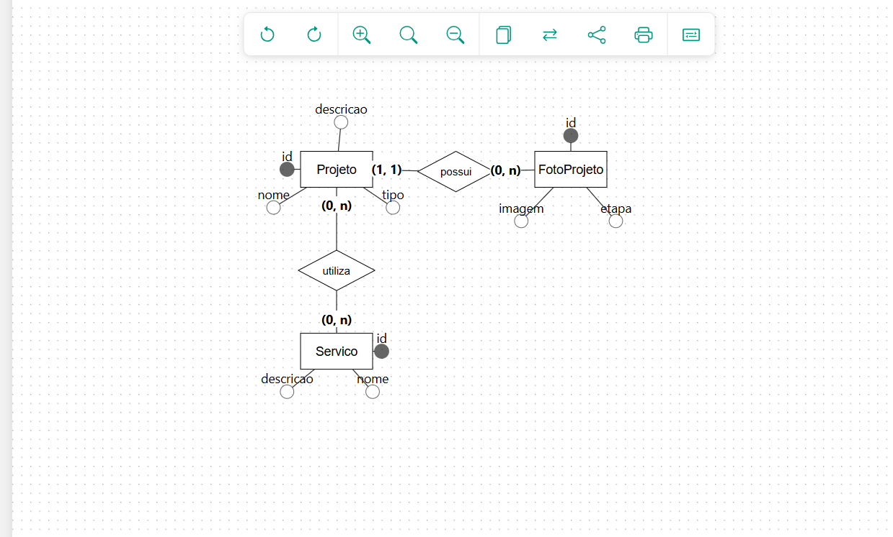

# #TF03 - Projeto de Banco de Dados: Construtora Alves

## 1. Descrição do Domínio

* **Nome dos integrantes da equipe:**
  * Júlia Moreira Soares
  * Lara Simões de Almeida
  * Lara Vitória Souza Silva
  * Maria Valentina Souza
  * Rayanne Bandeira Rocha
  * Stheffani Brenda Rodrigues de Oliveira
* **Qual é o tema do sistema:** Sistema de Gestão de Projetos e Portfólio para a Construtora Alves.
* **Quem são os usuários:** Administradores/Engenheiros da construtora (que gerenciam as obras e o catálogo de serviços) e Clientes (que acedem ao site para visualizar o portfólio e serviços oferecidos).
* **Qual problema o sistema resolve:** O sistema resolve a centralização e a divulgação do portfólio da construtora, permitindo associar quais serviços foram prestados em cada projeto e organizar uma galeria de fotos categorizada por etapas da obra para acompanhamento técnico e apresentação comercial.

---

## 2. Modelo Conceitual

### Descrição das Entidades

* **Projeto:** Representa as obras e reformas gerenciadas pela Construtora Alves. Possui os atributos `id` (identificador único numérico para controlo do sistema), `nome` (título da obra para identificação visual), `descricao` (detalhamento técnico e escopo da obra) e `tipo` (categoria do projeto, ex: Residencial, Reforma ou Interiores). Esta entidade existe para centralizar todos os dados cadastrais das obras do portfólio.
* **Servico:** Representa as modalidades de serviços de engenharia oferecidos pela empresa. Possui os atributos `id` (identificador único do serviço), `nome` (denominação da atividade, ex: Gerenciamento de Obras, Regularização) e `descricao` (detalhamento do que está incluído na prestação do serviço). Esta entidade existe para padronizar e catalogar as soluções técnicas que a construtora pode realizar.
* **FotoProjeto:** Representa os registos fotográficos das obras. Possui os atributos `id` (identificador único da fotografia), `imagem` (URL ou caminho do arquivo da imagem armazenada) e `etapa` (campo opcional indicando a fase da obra, como "Antes", "Durante" ou "Concluído", justificando-se como opcional pois nem toda foto requer vinculação estrita a uma etapa). Esta entidade existe para permitir a exibição da galeria visual e do histórico de progresso das obras.

### Relacionamentos e Cardinalidades

* **Projeto — FotoProjeto (`possui`):** Um **Projeto** pode possuir **nenhuma ou várias** `FotoProjeto` registradas para acompanhar o seu progresso, enquanto cada **FotoProjeto** pertence obrigatoriamente a um **único** `Projeto`. *(Cardinalidade: 1:N)*

## 5. Evidência funcional

Abaixo encontra-se a evidência do Prisma Studio comprovando que as tabelas foram criadas e populadas com sucesso pelo seed:

* **Projeto — Servico (`utiliza`):** Um **Projeto** pode utilizar **nenhum ou vários** `Servico` da construtora para ser executado, e um mesmo **Servico** pode estar presente em **nenhum ou vários** `Projeto` distintos. *(Cardinalidade: N:M)*
